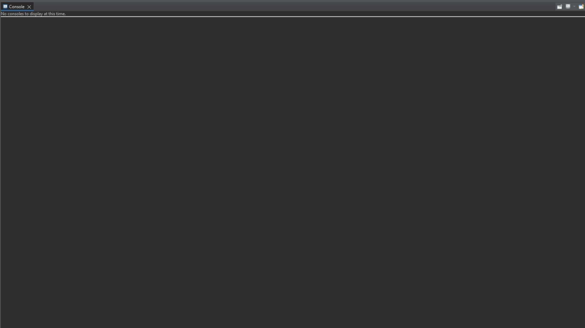

# Projeto CarroThread_Obj2

> Projeto: Simulação de Corrida de Carros Multi-thread.

Este projeto foi desenvolvido por Arthur Covelo, com o propósito de criar uma aplicação que simula uma corrida de carros utilizando múltiplas threads. O projeto segue as seguintes diretrizes:

Cada carro é implementado em uma thread individual;
Uma linha de chegada é definida para avaliar quando um carro alcança seu destino;
A cada iteração, uma aceleração aleatória é aplicada ao carro, resultando em alterações na sua velocidade e deslocamento ao longo do processo de simulação.
Durante a execução da aplicação, um log de informações é gerado, conforme exemplificado abaixo:

- Carro_01 percorreu 21m, agora está a 21m da linha de chegada.
- Carro_02 percorreu 21m, agora está a 21m da linha de chegada.
- Carro_03 percorreu 47m, agora está a 47m da linha de chegada.
- Carro_05 percorreu 46m, agora está a 46m da linha de chegada.
- Carro_01 percorreu 34m, agora está a 55m da linha de chegada.
- Carro_03 alcançou a linha de chegada.
- Carro_05 percorreu 49m, agora está a 200m da linha de chegada.
- Carro_05 alcançou a linha de chegada.
- Carro_02 alcançou a linha de chegada.
- Carro_01 alcançou a linha de chegada.
- Carro_04 percorreu 31m, agora está a 200m da linha de chegada.
- Carro_04 alcançou a linha de chegada.

Neste projeto, a simulação de uma corrida de carros utilizando threads permite a representação dinâmica do progresso de cada carro, tornando a aplicação mais próxima da realidade de uma corrida. 

O log de informações fornecido evidencia o desenvolvimento da corrida e os carros que alcançaram a linha de chegada.

## 🛠 Tecnologias

- Java
- Multi-Thread
- Git e Github

## 🖤 Contato

Arthurcovelo@gmail.com

[🔗 Clique aqui para acessar](https://arthurcovelo.github.io/ProjetoWeb_Profile/)

